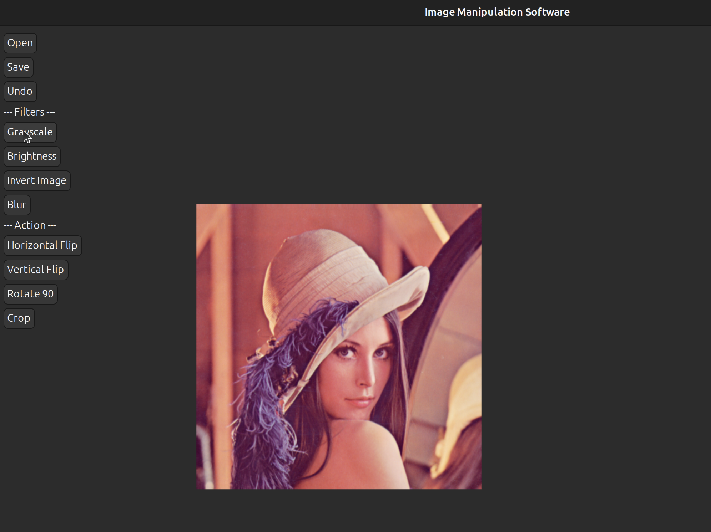
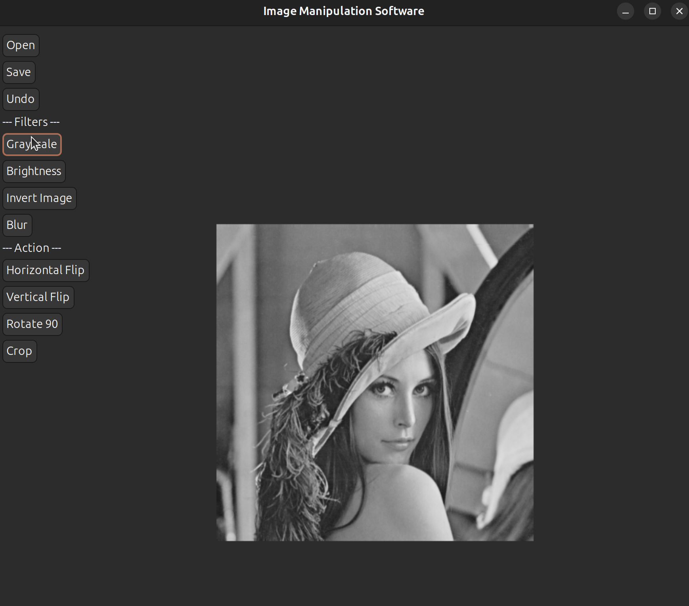

# IMAGE-MANIPULATION-SOFTWARE
# Image Manipulation Software (C + IUP)

A simple graphical image editor written in C using the IUPtoolkit for the GUI. Built as a final project for **CSE1101L**, it demonstrates structured programming — functions, structs, arrays, pointers, and dynamic memory allocation — applied to real pixel manipulation on 24-bit uncompressed BMP images.

All image-processing algorithms (grayscale, blur, rotation, etc.) are implemented from scratch on raw pixel data; no external library is used to perform the manipulations themselves.

## Screenshots

| Original Image Loaded | Grayscale Filter Applied |
| :---: | :---: |
|  |  |

## Features

- **Open** — load a 24-bit uncompressed BMP image via a file dialog
- **Save** — export the current image as a BMP file
- **Undo** — revert the most recent operation (single-level)
- **Grayscale** — luminance-weighted conversion (`0.299R + 0.587G + 0.114B`)
- **Brightness** — add/subtract a user-specified amount, clamped to 0–255
- **Invert** — negative-style color inversion
- **Horizontal Flip** — mirror left-to-right
- **Vertical Flip** — mirror top-to-bottom
- **Rotate 90°** — clockwise rotation (dimensions swap)
- **Crop** — extract a user-defined rectangular region
- **Blur** — 3×3 neighborhood averaging

## Project Structure

```
.
├── allheaderfile.h   # Shared struct definitions and function declarations
├── gui.c             # IUP window/button setup and callbacks (main entry point)
├── display.c         # BMP loading/saving, display refresh, undo state
└── manipulation.c    # Image-processing algorithms (grayscale, blur, flip, etc.)
```

Callbacks in `gui.c` only invoke the corresponding `apply_*()` function — the actual logic lives in `manipulation.c`, keeping the GUI and image-processing code decoupled.

## Requirements

- A C compiler (GCC, MinGW, or MSVC)
- The [IUP toolkit] development package (headers + libraries) for your OS

## How to Compile and Run

Before compiling, make sure the **IUP toolkit** is downloaded and installed on your system — you'll need its header files and library files available to your compiler. Get it from the official site: https://www.tecgraf.puc-rio.br/iup/

Once IUP is installed, compile and run using the commands below for your OS.

### Linux

```bash
# 1. Compile and link
gcc gui.c manipulation.c display.c -o image_editor -liup

# 2. Run the program
./image_editor
```

### Windows

```bat
:: 1. Compile and link
gcc gui.c manipulation.c display.c -o image_editor.exe -liup -lgdi32 -lcomdlg32 -lcomctl32 -luuid -lole32

:: 2. Run the program
image_editor.exe
```

## Usage

1. Run the compiled executable.
2. Click **Open** and select a `.bmp` file (must be 24-bit, uncompressed).
3. Apply any of the filters/actions from the side panel — the display updates automatically.
4. Click **Undo** to revert the last operation, if needed.
5. Click **Save** to export the result as a new `.bmp` file.

## Supported Image Format

Only **24-bit uncompressed BMP** is supported, per the assignment spec. Opening a file with a different bit depth, compression, or an invalid signature will show an error message rather than crash.

## Limitations

- Only one level of undo (no redo/undo history stack)
- Only BMP is supported — no PNG/JPEG/GIF
- Optional sharpening filter (bonus feature) not implemented

## Course Context

Developed for the **CSE1101L** final project assignment, focused on structured programming in C: structs, pointers, dynamic memory management, and modular design, paired with an IUP-based GUI.
